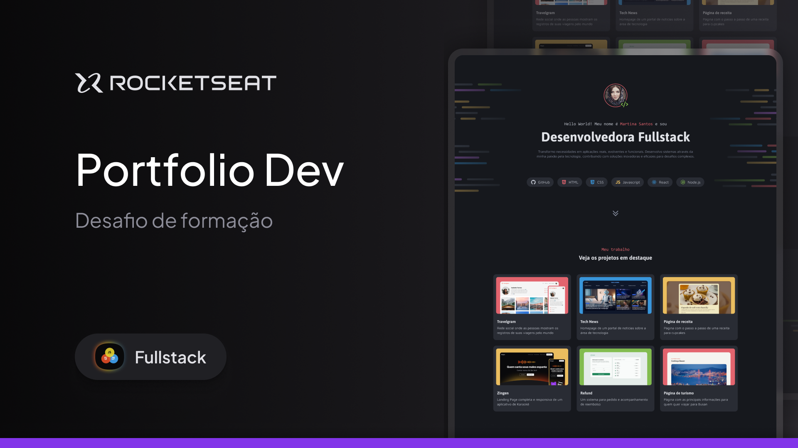

  

# 💼 Portfólio Dev

Projeto prático desenvolvido como parte do **#2 Desafio da Formação Fullstack da Rocketseat**, com foco na construção de um site de **portfólio profissional** utilizando apenas **HTML e CSS**.

## 📌 Descrição

Este projeto tem como objetivo a criação de um site **desktop-first** para desenvolvedores, com seções dedicadas à apresentação pessoal, projetos e formas de contato. É um exercício completo de estruturação e estilização de uma interface profissional com base em fundamentos da web.

Durante o desenvolvimento, foram aplicadas diversas técnicas fundamentais, entre elas:

- Criação de layouts com **CSS Flexbox** e **CSS Grid**
- Uso de **variáveis CSS** para consistência no design
- Aplicação de **pseudo-classes e pseudo-elementos**
- Posicionamento preciso de elementos
- Organização semântica do HTML

## 🚀 Objetivo

Consolidar o conhecimento adquirido na formação até aqui, transformando teoria em prática e preparando a base para projetos mais complexos. O desafio foca no desenvolvimento de autonomia, visão estética e domínio técnico das tecnologias básicas da web.

## 🛠️ Tecnologias Utilizadas

- HTML5
- CSS3
- Flexbox
- Grid Layout
- Git/GitHub

## 🔗 Acesse o Projeto

👉 **[Visualizar Portfólio Dev no GitHub Pages](https://codebyneander.github.io/portfolio-dev/)**

---

## 📬 Entre em Contato

Se quiser trocar uma ideia, dar feedback ou conversar sobre tecnologia, me chama por aqui:

  <a href="https://www.linkedin.com/in/renan-guilherme/" target="_blank">
    
    LinkedIn
  </a>

  <a href="mailto:renanguilherme.profissional@outlook.com">
    
    renanguilherme.profissional@outlook.com
  </a>

  <a href="https://instagram.com/renan.guilhermec" target="_blank">
    
    @renan.guilhermec
  </a>

## 🙏 Agradecimentos

Este projeto foi desenvolvido como parte de uma atividade prática da **Rocketseat**, plataforma da qual sou aluno e que tem sido peça-chave na minha formação como desenvolvedor web fullstack.

A metodologia direta, o conteúdo aplicado ao mercado e o suporte da comunidade elevam a qualidade do aprendizado e tornam o processo mais acessível, mesmo nos momentos de desafio.

> Obrigado, Rocketseat. 🚀

